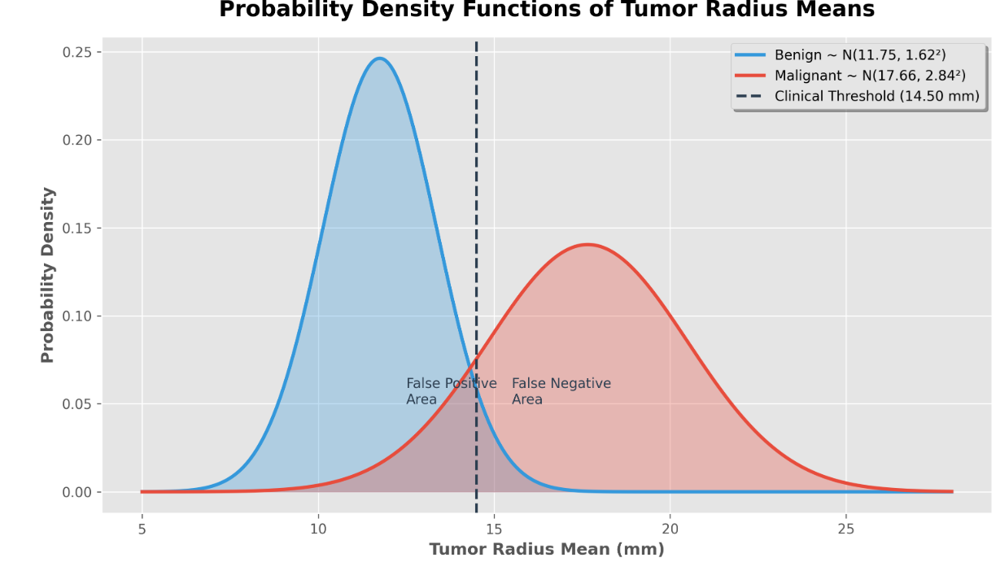

<h1 align="center">Predictive Modeling of Tumor Classifications</h1>

<p align="center">
  <em>An Advanced Predictive Framework for Clinical Prognostic Forecasting using Continuous Normal Distributions</em>
</p>

---

## 1. Introduction to Predictive Mathematical Modeling

This repository hosts the statistical analysis framework designed to transition historical medical dataset summarization into an advanced predictive system. By modeling tumor radius means through theoretical normal distributions, the framework shifts the clinical paradigm from retrospective summaries to prognostic forecasting.

## 2. Parameter Extraction & Summary Metrics

Before implementing continuous probability density modeling, primary sample population parameters were isolated and processed. Raw data points were segregated by diagnostic classification (**M** for Malignant and **B** for Benign) under the "Radius mean" vectors.

| Diagnostic Group | Sample Size (n) | Sample Mean (&mu;) | Standard Deviation (&sigma;) | Median |
| :--- | :---: | :---: | :---: | :---: |
| **Benign (X<sub>B</sub>)** | 32 | 11.75 mm | 1.62 mm | 11.89 mm |
| **Malignant (X<sub>M</sub>)** | 18 | 17.66 mm | 2.84 mm | 18.30 mm |

## 3. The Normal Distribution Models

Let **X<sub>B</sub>** and **X<sub>M</sub>** represent the continuous random variables for the radius mean of benign and malignant tumors respectively. 

* **Benign Curve Representation:** X<sub>B</sub> ~ N(11.75, 1.62²)
* **Malignant Curve Representation:** X<sub>M</sub> ~ N(17.66, 2.84²)

### Visualization of Probability Curves

*(The malignant distribution exhibits significant horizontal translation due to accelerated growth dynamics, and a wider, flatter profile due to higher structural variation).*



## 4. Clinical Threshold Strategy & Diagnostic Risks

A baseline clinical threshold is established at **k = 14.50 mm**. Any tumor displaying a radius mean greater than 14.50 mm is classified as malignant.

### Diagnostic Decision Flow

```mermaid
graph TD
    A[New Patient Tumor Data] --> B{Is Radius Mean > 14.50 mm?}
    
    B -- Yes --> C[Classify as Malignant]
    B -- No --> D[Classify as Benign]
    
    C -.-> E[⚠️ False Positive Risk: 4.49%]
    D -.-> F[⚠️ False Negative Risk: 13.27%]
    
    style B fill:#f9f2f4,stroke:#d04437,stroke-width:2px
    style C fill:#ffebee,stroke:#c62828
    style D fill:#e8f5e9,stroke:#2e7d32
